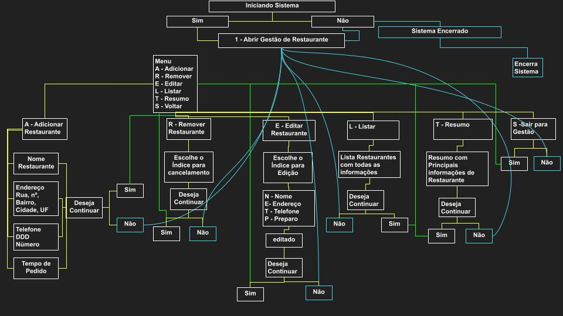
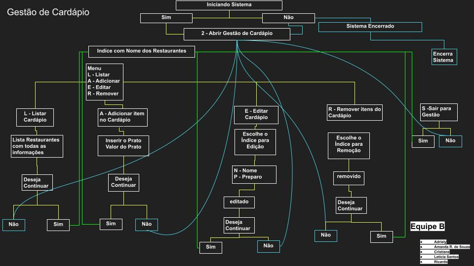

# Projeto: Sistema de Gestão de Restaurantes

## Apresentação do Projeto

O projeto "Sistema de Gestão de Restaurantes" é uma aplicação em Python que permite a gestão de restaurantes em uma plataforma. Com esta ferramenta, os usuários podem adicionar, editar ou remover restaurantes, bem como gerenciar os menus de cada restaurante, incluindo o nome dos alimentos e seus preços. Este projeto foi desenvolvido com o objetivo de fornecer aos alunos um caso de uso real e prático, permitindo-lhes aplicar os conceitos básicos de programação que aprenderam, como variáveis, estruturas condicionais, estruturas de repetição, listas e funções.

## Funcionalidades do Projeto

O sistema possui 12 funções que estão distribuidas para formatações, índices, validações, fazendo com que se conciliem em duas funções principais, que são as seguintes: 

1. **Gestão de Restaurantes:**
   - Adiciona um restaurante com informações como nome, endereço, telefone e tempo de entrega.
   - Edita informações de um restaurante existente.
   - Remover um restaurante da plataforma.

   
   
   O Fluxograma mostra como trabalha a Função Gestão de Restaurante, com os respectivos comandos até que cliente solicite retorno ou saída.

3. **Gestão de Cardápio:**
   - Para cada restaurante, os usuários podem adicionar, editar ou remover itens do cardápio.
   - Cada item do cardápio possui um nome e um preço.

   
   
   O FLuxograma mostra como funiona a Função Gestão de Cardápio, na qual está sinalizada como 2. O cliente pode escolher entre ir para Gestão de Restaurantes, Gestão de Cardápios ou Encerrar o Sistema.

5. **Apresentação de Informações:**
   - Os usuários podem visualizar a lista de todos os restaurantes registrados na plataforma, incluindo seus detalhes.
   - Para cada restaurante, é possível visualizar o cardápio completo, listando os alimentos disponíveis e seus preços.

6. **Funcionalidades Adicionais (Opcionais):**
   - Adicionada a Opção de Resumo, em Gerenciamento de Restaurante, onde é possível que usuário tenha acesso as principais informações do Restaurantes numa visão mais aconchegante
   - Além da opção de Encerrar o programa, inserimos uma função na qual volta o código para uma função principal, onde insistimos ao usuário que não encerre o sistema, permaneça mais conectado e alimentando com os dados inseridos.
   - Para Leitura das imagens do Fluxograma, usamos os seguintes um sistema de cores para relação, onde:  amarelo  = conexão de desenvolvimento,  azul  = não, retorna à função original,  verde  = sim, retorna ao indíce da função.
   -

## Conclusão do Projeto com os Conceitos Principais Aplicados

Neste projeto, os alunos tivemos a oportunidade de aplicar os seguintes conceitos principais de programação em Python:

- **Variáveis:** para armazenar informações sobre restaurantes, seus cardápios e outros dados relevantes.

- **Estruturas Condicionais:** Serão necessárias estruturas condicionais para permitir a tomada de decisões, como verificar se um restaurante ou item do cardápio existe ou se o usuário deseja realizar ações específicas.

- **Estruturas de Repetição:** Para facilitar a gestão de múltiplos restaurantes e itens de cardápio, com estruturas de repetição para percorrer listas e realizar ações em lote.

- **Listas:** As informações sobre restaurantes e seus cardápios são armazenadas em listas, permitindo a manipulação e organização dos dados.

- **Funções:** Criadas para organizar o código e torná-lo mais modular e reutilizável, como funções para adicionar restaurantes/ cardápios, editar restaurantes/cardápios, entre outras.

Este projeto ofereceu uma oportunidade prática para consolidar o aprendizado dos conceitos fundamentais de programação em Python. Além disso, pudemos expandir o projeto com funcionalidades adicionais. 
O resultado final é um projeto que pode ser destacado no portfólios, demonstrando habilidades na criação de aplicativos Python do mundo real.

## Autores do Projeto 
- Turma Vem Ser Tech - Dados | 1101
- Adriely Boller
- Amanda R. de Souza
- Cristiane Rabelo
- Letícia Santos
- Ricardo Mazzeo
